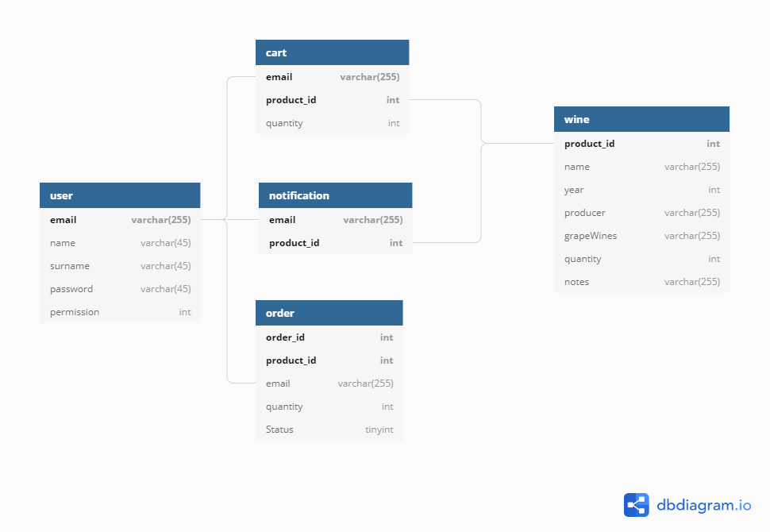

## Third assignment for my Software Engineering course.

Developed with a [colleague](https://github.com/marticaffa).

This is a server app based on [Wine Ecommerce](https://github.com/Sclafus/Wine-Ecommerce).

It's using:

-   Client-Server architecture (with JDBC)
-   SQL Database (MySQL)

This program is the **server** of the architecture (clearly).

The Client application is available [here](https://github.com/Sclafus/Ecommerce-GUI).

The DB structure is pretty simple. It has some flaws, but this is not meant to be used in production, so... 🤷‍♂️

